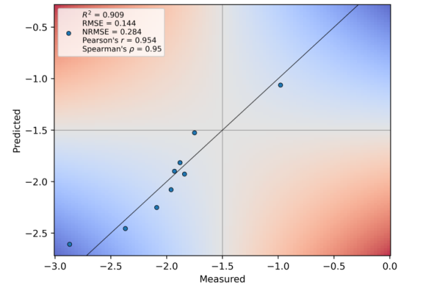

This repository contains supplementary information to

Niklas E. Siedhoff<sup>*§*</sup>, Alexander-Maurice Illig<sup>*§*</sup>, Ulrich Schwaneberg, Mehdi D. Davari, PyPEF – an Integrated Framework for Data-driven Protein Engineering, submitted to Journal of Chemical Information and Modeling, 2021 

<sup>*§*</sup><sub>equal contribution</sub>

# PyPEF: Pythonic Protein Engineering Framework

a framework written in Python 3 for performing sequence-based machine learning-assisted protein engineering.


Protein engineering by rational or random approaches generates data that can aid the construction of self-learned sequence-function landscapes to predict beneficial variants by using probabilistic methods that can screen the unexplored sequence space with uncertainty *in silico*. Such predictive methods can be applied for increasing the success/effectivity of an engineering campaign while partly offering the prospect to reveal (higher-order) epistatic effects. Here we present an engineering framework termed PyPEF for assisting the tuning and validation of models for combination of identified substitutions using machine learning algorithms (partial least squares (PLS), support vector machines (SVR), random forest (RF), and multilayer perceptron (MLP)-based regression) from the [scikit-learn](https://github.com/scikit-learn/scikit-learn) package. As training input, the developed software tool requires the sequence and the corresponding screening results (fitness labels) of the identified variants as .csv (or .fasta datasets following a self-defined convention). Using PLS, SVR, RF, or MLP regression, PyPEF trains on the given learning data while optimizing model hyperparameters and validates model performances on left-out data. Finally, the selected or best model for validation can be used to perform directed evolution walks *in silico* (see [Church-lab implementation](https://github.com/churchlab/UniRep) or the [reimplementation](https://github.com/ivanjayapurna/low-n-protein-engineering)) or to predict natural diverse or recombinant sequences that subsequently are to be designed and validated in the wet-lab.


Detailed information is given in the following publication, 

PyPEF - an Integrated Framework for Data-driven Protein Engineering,

and the workflow procedure is explained in the [Jupyter notebook](/workflow/Workflow_PyPEF.ipynb) (.ipynb) protocol (see
./workflow directory).  

## Tutorial

Before starting running the tutorial, it is a good idea to set-up a new Python environment using Anaconda, https://www.anaconda.com/, e.g. using [Anaconda](https://www.anaconda.com/products/individual) ([sh installer](https://repo.anaconda.com/archive/Anaconda3-2020.11-Linux-x86_64.sh)) or [Miniconda](https://docs.conda.io/en/latest/miniconda.html).
Change to the download directory and run the installation, e.g. in Linux:

```
bash Anaconda3-2020.11-Linux-x86_64.sh
```

After accepting all steps, the conda setup should also be written to your `~/.bashrc`file, so that you can call anaconda typing `conda`.
To setup a new environment you can either create the conda environment from the provided YAML file:

```
conda env create --file pypef_environment.yml
```

or you can create a new environment yourself. You just need to specify the name of the environment and the Python version, e.g.:

```
conda create --name pypef python=3.7
```

To activate the environment you can define:

```
conda activate pypef
```

To download this repository click `Code > Download ZIP` and unzip the zipped file, e.g., with `unzip PyPEF-main.zip`, or just clone this repository using your bash shell to your local machine `git clone https://github.com/niklases/PyPEF`.
After activating the environment you can install required packages after changing the directory to the PyPEF directory (`cd PyPEF` or `cd PyPEF-main` dependent on the downloaded file name) and install required packages with pip if you did not use the YAML file for creating the environment (when using conda packages will be installed in `anaconda3/envs/pypef/lib/python3.7/site-packages`):

```
python3 -m pip install -r requirements.txt
```

and optionally:

```
python3 -m pip install -r requirements_parallelization.txt
```

Now you should be able to directly start with the tutorial - or run pypef in your preferred command line interpreter.

To run the tutorial after installing required packages either from the YAML environment file or the TEXT file(s), you have to open a Jupyter Notebook. If you have installed Anaconda, Jupyter Notebook and other commonly used packages for scientific computing and data science should be already installed in Python. If not, you can also install Jupyter via `conda install ipython jupyter`. To use the pypef environment as kernel inside the Jupyter Notebook, you need to install the ipykernel:

```
conda install anaconda ipykernel
python -m ipykernel install --user --name=pypef
```

Now change the directory to ./workflow (`cd workflow`) and run the .ipynb file:

```
jupyter notebook
```

Copy the notebook URL in your internet browser and select the `Workflow_PyPEF.ipynb` file to open it. Now you can select the pypef Python environment at the top Notebook menu: Kernel > Change kernel > pypef (else you would use your standard Python version as environment, i.e., you would have to install required packages also for that interpreter). 

Good luck and have fun!
